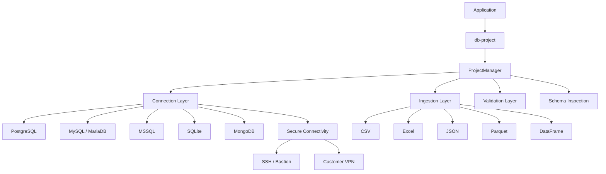

# db-project

A standalone data-ingestion + database-connection manager for Python.

It does one job, per "project" (think: one client / one workspace):

1. **Register database connections** — SQL or NoSQL — reached **directly**, over an **SSH/Bastion tunnel**, or over a **Customer VPN** (WireGuard/OpenVPN).
2. **Accept file uploads** (CSV / Excel / JSON / Parquet) per project.
3. **Validate** a file or DataFrame against a schema before it goes anywhere.
4. **Inspect schemas** — of an uploaded file or of a table already in a database.
5. **Convert an upload — or any DataFrame — into a real table/collection**, via replace, append, or upsert, in one of the registered database connections.



```
Database Connection
       |
 +-----+-----+
 |           |
Direct    Secure Tunnel
 |           |
host:port  +----+----+
           |         |
      SSH/Bastion  Customer VPN
                    (WireGuard/OpenVPN/etc.)
           +----+----+
                |
                DB
```

It has no dependency on any larger app or framework — import it into
whatever you're building.

> **Upgrading from 0.1.x?** Nothing you already call has changed — see
> [`MIGRATION.md`](MIGRATION.md) for exactly what's new and what (nothing)
> you need to change.

---

## Install

This package isn't required to be on PyPI to install it — you can install
it straight from this folder (see `PACKAGING_GUIDE.md` if you've never built
a Python package before and want the full walkthrough).

```bash
# from inside this project's root folder (where pyproject.toml lives)
pip install .
```

Only `pandas` and `sqlalchemy` are installed by default. Everything else —
DB drivers, file-format libraries, SSH-tunnel support — is an **optional
extra**, so you only install what you actually use:

```bash
# Talking to Postgres, with Excel/Parquet upload support:
pip install ".[postgres,files]"

# Postgres + MySQL + SSH tunnels + MongoDB:
pip install ".[postgres,mysql,tunnel,mongo]"

# Everything, including the FastAPI test harness:
pip install ".[all]"
```

Available extras: `postgres`, `mysql`, `mssql`, `mongo`, `files`, `tunnel`, `api`, `all`, `test`.

**Customer VPN sources are the one exception** — WireGuard/OpenVPN support
needs `wireguard-tools` and/or `openvpn` installed as **system** packages
(not pip installable), e.g.:

```bash
sudo apt-get install wireguard-tools openvpn
```

### Editable / development install

While you're actively changing the code, install in editable mode so your
edits are picked up without reinstalling:

```bash
pip install -e ".[all]"
```

## Quickstart

```python
from db_project.manager import ProjectManager

pm = ProjectManager()
pm.create_project("acme")

# 1. A normal SQL connection
pm.add_sql_source("acme", "warehouse",
    dialect="postgres", host="db.acme.com", port=5432,
    database="warehouse", username="svc", password="secret")

# 2. A SQL connection that's ONLY reachable via an SSH bastion
pm.add_sql_source("acme", "internal_mysql",
    dialect="mysql", host="10.0.4.12", port=3306,
    database="app", username="svc", password="secret",
    tunnel={
        "ssh_host": "bastion.acme.com",
        "ssh_username": "deploy",
        "ssh_pkey_path": "/secrets/id_rsa",   # or ssh_password="..."
    })

# 2b. A SQL connection that's ONLY reachable via a Customer VPN
#     (WireGuard shown; vpn_type="openvpn" also supported)
pm.add_sql_source("acme", "customer_vpn_db",
    dialect="postgres", host="10.50.0.5", port=5432,
    database="app", username="svc", password="secret",
    vpn={
        "vpn_type": "wireguard",
        "config_path": "/secrets/customer_acme.conf",  # pre-made by the customer/network team
    })

# 3. A NoSQL connection
pm.add_nosql_source("acme", "events",
    engine="mongodb", host="mongo.acme.com", port=27017, database="events")

# 4. Upload a file
with open("ratings.csv", "rb") as f:
    pm.save_upload("acme", "ratings.csv", f.read())

# 5. THE CONVERSION STEP — turn the upload into a real table
pm.upload_to_database("acme", "ratings.csv",
    target_source="warehouse", table_name="ratings", if_exists="replace")

# 6. Query anything back out as a DataFrame
df = pm.query_sql("acme", "warehouse", "SELECT * FROM ratings LIMIT 10")
df2 = pm.fetch_nosql("acme", "events", collection="clicks", limit=100)
```

Both secure-tunnel methods are handled transparently — `query_sql` /
`upload_to_database` bring the SSH tunnel or the VPN interface up, connect
through it, and tear it back down again automatically, whether the target
is `sql` or `nosql`. A source may use **at most one** of `tunnel` / `vpn` —
registering both raises `ValueError`.

Note the difference between the two: SSH forwards a **local port**
(`_open_sql`/`_open_nosql` rewrite `host`/`port` to `127.0.0.1:<local>`),
while a VPN interface makes the DB's **real** private address (e.g.
`10.50.0.5:5432`) directly routable — host/port are left untouched.

## Validation

Validate a file or a DataFrame before it ever touches a database. Returns a
structured result, never just `True`/`False`:

```python
import pandas as pd
from db_project import validate

df = pd.DataFrame({"sale_id": [1, 2, 2], "price": [9.99, -1.0, 19.99]})

result = validate(
    df,
    schema={"sale_id": "integer", "price": "float"},   # column -> expected type
    required_columns=["sale_id", "price"],
    unique_columns=["sale_id"],                          # flags the duplicate id
    range_checks={"price": {"min": 0}},                   # flags the negative price
    allow_nulls={"price": False},
)
# {
#   "valid": False,
#   "errors": [
#     {"check": "duplicate", "column": "sale_id", "message": "..."},
#     {"check": "range", "column": "price", "message": "..."},
#   ],
#   "warnings": [],
#   "statistics": {"row_count": 3, "column_count": 2, "null_counts": {...}},
# }
```

Same thing via `ProjectManager` (identical signature, so it fits naturally
into an ingest-then-validate-then-write flow):

```python
result = pm.validate(df, schema={"sale_id": "integer", "price": "float"})
if result["valid"]:
    pm.dataframe_to_database("acme", df, "warehouse", "sales")
```

## Schema inspection

```python
# What does this upload look like, before you commit to a table shape?
schema = pm.inspect_file("acme", "sales.csv")
# {"columns": [{"name": "sale_id", "detected_type": "integer", "nullable": False}, ...],
#  "row_count": 1523}

# Or a DataFrame you already have:
schema = pm.inspect_dataframe(df)

# Or an existing table in a registered database — straight from the DB,
# no file involved:
schema = pm.inspect_database("acme", "warehouse", "sales")
# [{"name": "sale_id", "detected_type": "INTEGER", "nullable": False}, ...]
```

## Ingestion modes: replace / append / upsert

```python
# Wholesale replace or append (unchanged from 0.1.x):
pm.upload_to_database("acme", "sales.csv", target_source="warehouse",
                       table_name="sales", if_exists="replace")

# Upsert: match on one or more key columns, update matches, insert the rest.
pm.upload_to_database("acme", "sales_delta.csv", target_source="warehouse",
                       table_name="sales", if_exists="upsert",
                       upsert_keys=["sale_id"])

# Works for Mongo targets too (uses bulk ReplaceOne(..., upsert=True)):
pm.dataframe_to_database("acme", df, "events_collection", "clicks",
                          if_exists="upsert", upsert_keys=["event_id"])
```

`upsert` works the same way across postgres/mysql/mariadb/mssql/sqlite — it
stages the incoming data, updates rows whose key already exists, and inserts
the rest, all inside one transaction, rather than relying on a
dialect-specific `ON CONFLICT`/`ON DUPLICATE KEY` clause.

## Errors

Every error `db_project` raises is a `db_project.exceptions.DBProjectError`,
and each also subclasses the builtin exception 0.1.x code already expects —
so `except ValueError` / `except RuntimeError` / `except KeyError` from
before still catch what they used to:

```
DBProjectError
├── ConfigurationError    (also a ValueError)
├── ConnectivityError     (also a RuntimeError)
│   ├── ConnectionError
│   └── AuthenticationError
├── IngestionError        (also a RuntimeError)
├── ValidationError       (also a ValueError)
└── SchemaError           (also a ValueError)
```

The original low-level error (a driver exception, a `paramiko` error, etc.)
is always preserved as `.__cause__`:

```python
from db_project.exceptions import ConnectivityError

try:
    pm.query_sql("acme", "warehouse", "SELECT 1")
except ConnectivityError as e:
    print(e)          # db_project's message
    print(e.__cause__)  # the original driver/network exception
```

## Logging & secrets in logs

`db_project` logs through the standard `logging` module under the
`"db_project"` logger and, like any well-behaved library, emits nothing
until you configure a handler:

```python
import logging
logging.basicConfig(level=logging.INFO)
```

```
INFO:db_project:Connecting to postgres (warehouse)
INFO:db_project:Connected to postgres (warehouse)
INFO:db_project:Reading csv file
INFO:db_project:Read 1523 row(s), 6 column(s)
INFO:db_project:Validation completed: valid=True errors=0 warnings=0
INFO:db_project:Writing 1523 row(s) to warehouse.sales (if_exists=upsert)
INFO:db_project:Wrote 1523 row(s) to warehouse.sales
```

Passwords, tokens, SSH keys, and VPN config paths are never logged — they're
redacted (`********`) anywhere `db_project` would otherwise log a config
dict or a connection URL. `source_info()` also never returns secret fields.

## Where data is stored

By default, `ProjectManager` writes each project's registered-connection
config and uploaded files under a `projects/` folder inside your **current
working directory** — i.e. wherever you run your script or start your app
from, not inside the installed package.

```
projects/
  {project_id}/
    config.json     <- registered connections (secrets can live in env vars instead)
    uploads/         <- raw uploaded files
```

Override the location with an environment variable if you want it
somewhere else (e.g. a persistent volume in production):

```bash
export DB_PROJECTS_ROOT=/var/lib/myapp/projects
```

## Secrets without committing them to config.json

Any `username` / `password` / `tunnel.ssh_password` field can be omitted
from `config.json` and supplied via an environment variable instead:

```
{PROJECT_ID}__{SOURCE_NAME}__PASSWORD
{PROJECT_ID}__{SOURCE_NAME}__SSH_PASSWORD
```

e.g. for project `acme`, source `warehouse`: `ACME__WAREHOUSE__PASSWORD`.

## Package layout

| Module | Purpose |
|---|---|
| `db_project/config.py` | `ProjectConfig` / `SourceConfig` / `SSHTunnelConfig` / `VPNConfig` dataclasses, load/save `config.json`, `connection_mode` derivation |
| `db_project/connectors/sql.py` | Dialect-agnostic SQL connector (postgres/mysql/mariadb/mssql/sqlite) — read via `query()`, write via `write_dataframe()` (replace/append/fail/upsert), `get_schema()` |
| `db_project/connectors/nosql.py` | MongoDB connector — `fetch_collection()` / `write_dataframe()` (replace/append/upsert) |
| `db_project/connectors/files.py` | CSV/Excel/JSON/Parquet → DataFrame |
| `db_project/connectors/tunnel.py` | SSH/Bastion tunnel context manager — forwards a local port |
| `db_project/connectors/vpn.py` | Customer VPN (WireGuard/OpenVPN) context manager — brings the interface up/down via `wg-quick`/`openvpn` |
| `db_project/schema.py` | `detect_dataframe_schema()` — column-level type/nullability detection |
| `db_project/validation.py` | `validate()` — required columns, dtype, null, duplicate, range, schema-compatibility checks |
| `db_project/exceptions.py` | `DBProjectError` hierarchy |
| `db_project/logging_utils.py` | The `db_project` logger + secret redaction (`redact()`, `redact_url()`) |
| `db_project/manager.py` | `ProjectManager` — the class you actually import |

Everything else in this repo (`main.py`, `dashboard/`) is optional and is
**not** part of the installable package — see below.

## Optional: FastAPI test harness

`main.py` wraps `ProjectManager` in a small FastAPI app so you can exercise
every feature over HTTP, e.g. from the included `dashboard/` (a React/Vite
analyst UI). It's a dev/demo harness, not something `pip install` ships —
run it straight from the repo:

```bash
pip install ".[api]"
uvicorn main:app --reload --port 8000
# then open http://127.0.0.1:8000/docs
```

## VPN config file (`vpn.config_path`)

`db_project` never generates or stores WireGuard/OpenVPN keys — the
customer/network team hands you a ready-made config file and you just point
`config_path` at it:

- **WireGuard**: a `.conf` file (your private key, the DB-side peer's public
  key + `AllowedIPs`, `Endpoint`, etc.), managed via `wg-quick up|down`.
- **OpenVPN**: a `.ovpn`/`.conf` file, optionally plus a separate
  `auth_user_pass_path` credentials file, run via `openvpn --config ... --daemon`.

Both require host-level tools (`wireguard-tools` / `openvpn`) and normally
root — see `VPNConfig` in `config.py` for every field (`use_sudo`,
`up_timeout`, `verify_connect_host`/`port`, etc.).

## Running the tests

```bash
pip install -e ".[all,test]"
pytest
```

`tests/unit/` (71 tests) runs fully offline: real SQLite for SQL-connector/
ingestion/upsert coverage, and mocked `pymongo`/`sshtunnel`/`subprocess` for
Mongo/SSH/VPN coverage — no live database, bastion, or VPN needed.
`tests/integration/` is reserved for opt-in tests against real services and
is empty by default.

## Security considerations

- **Never hardcode credentials.** Use `config.json` only for non-sensitive
  fields, and supply `username`/`password`/`ssh_password` via the
  `{PROJECT}__{SOURCE}__*` environment variables shown above.
- **Secrets are never logged.** Every log call in this package goes through
  redaction first (see *Logging & secrets in logs*), and `source_info()`
  returns only non-secret fields (host/port/database/connection mode).
- **VPN config files contain private key material.** `db_project` never
  generates, stores, or logs WireGuard/OpenVPN keys — it only ever holds a
  path to a file the customer/network team already produced, and that path
  itself is treated as sensitive and redacted from logs.
- **Invalid credentials fail loudly, not silently** — a bad password raises
  `AuthenticationError`/`ConnectionError` rather than hanging or returning
  empty data.
- **`.env`/environment-based config** means `config.json` can be committed
  to source control without ever containing a real secret.

## New to Python packaging?

See **`PACKAGING_GUIDE.md`** in this repo for a from-scratch, no-experience-
assumed walkthrough of what a Python package actually is, how this one is
structured, how to build it, install it, and (optionally) publish it.
